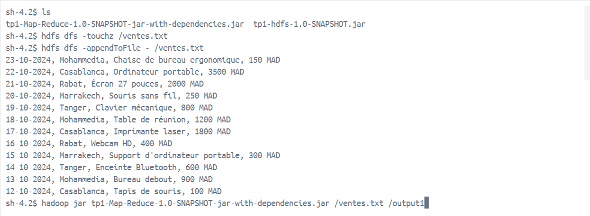
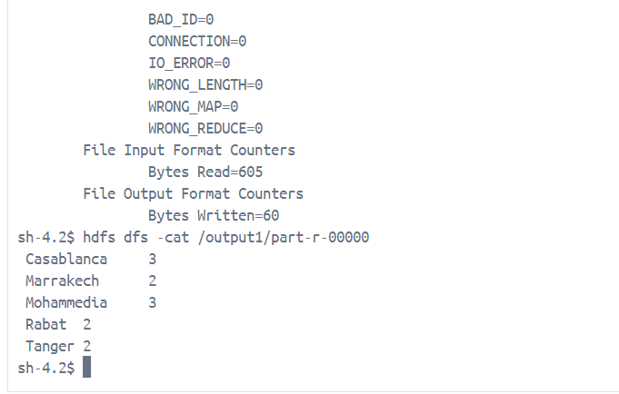
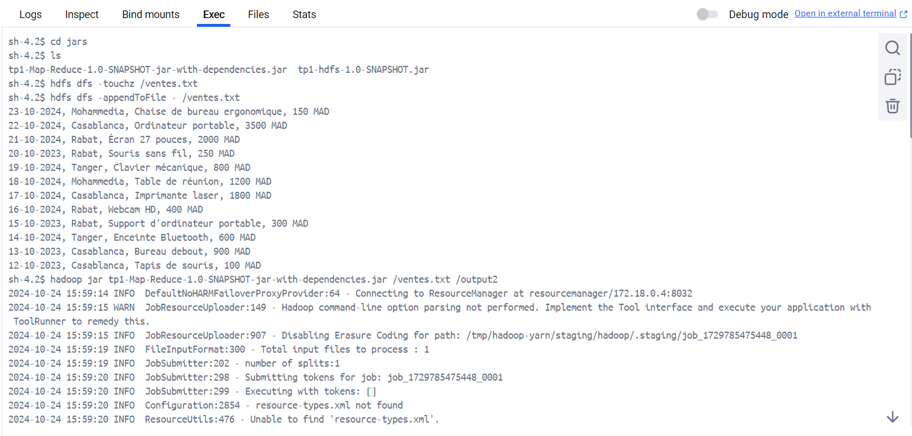
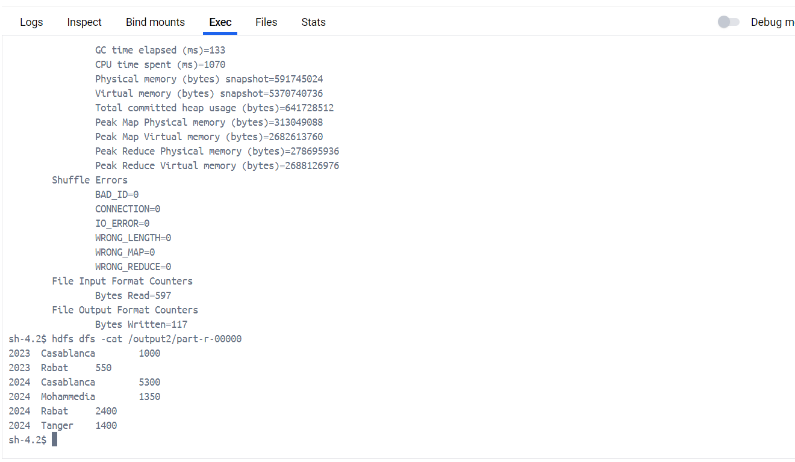
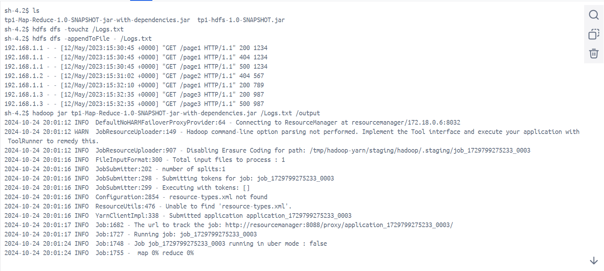
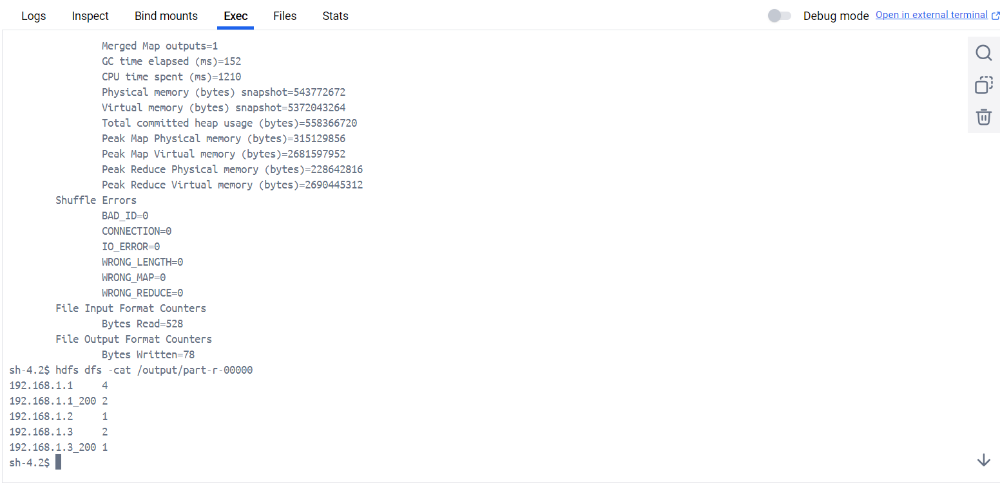

<h1>MAP REDUCE PRATICAL WORK</h1>

<h2>Exercie 1</h2>
<h3>Question 1</h2>
<h4>Déterminer le total des ventes par ville.</h4>

<h3>Question 2</h2>
<h4>Calculer le prix total des ventes des produits par ville pour une année donnée.</h4>

<h2>Exercie 2</h2>
<h3>Question </h2>
<h4>Effectuer une analyse des logs pour trouver le nombre total de requêtes par adresse IP, ainsi que le nombre de requêtes réussies (code de réponse HTTP 200) par adresse IP.</h4>

